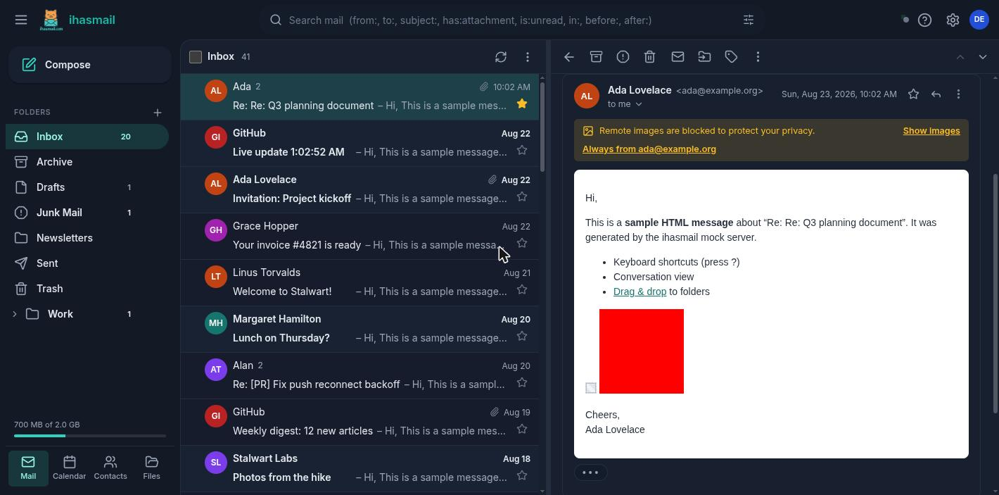
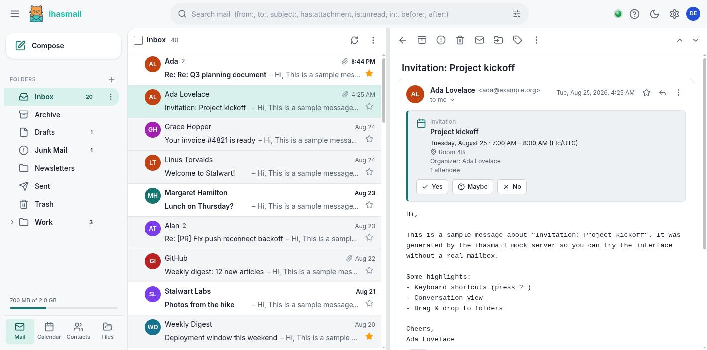
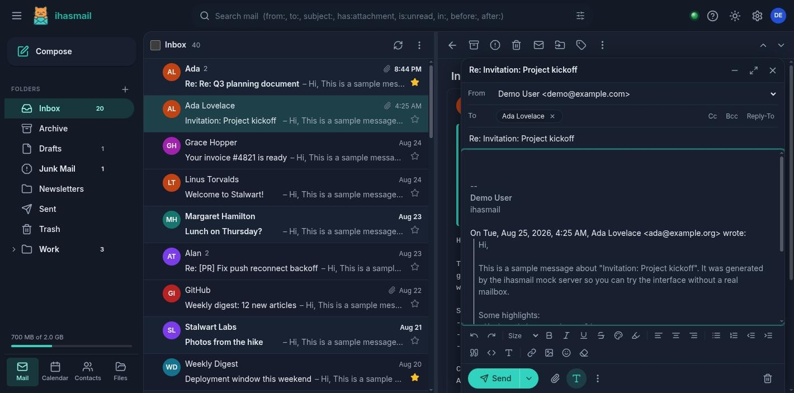
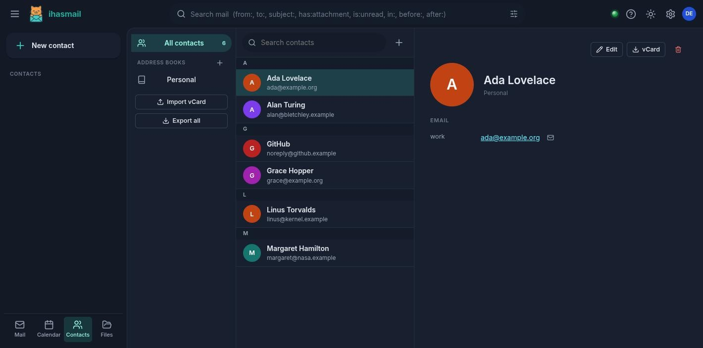
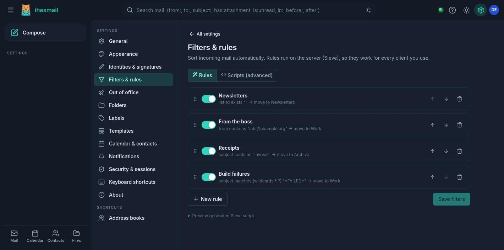
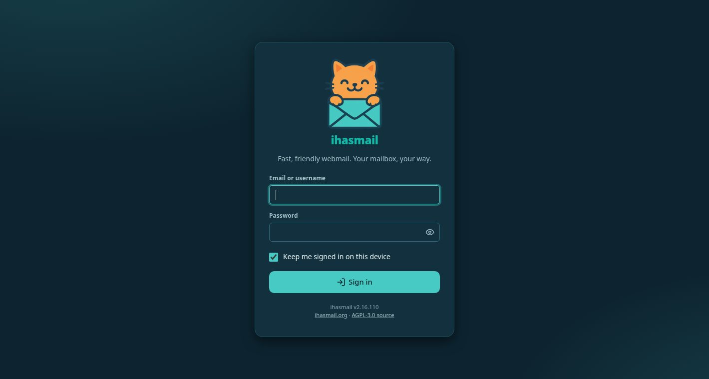
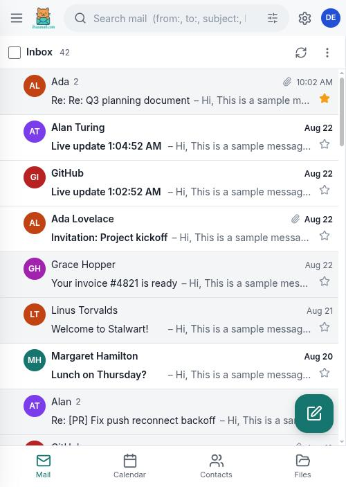

<p align="center">
  
</p>

# ihasmail

**A fast, friendly, Gmail-class webmail for [Stalwart Mail Server](https://stalw.art) — built on JMAP, from the ground up.**

ihasmail is a JMAP-first web client: mail, calendars, contacts, files, filters and every other modern feature Stalwart exposes, in a responsive single-page app that works equally well on a desktop monitor and a phone. It talks only JMAP (plus Stalwart's blob/upload/EventSource endpoints) — no IMAP, no SMTP, no database.

> Status: 2.0 rewrite, in QA against a live Stalwart server — **0.16.19**
> since 2026-08-25, 0.15.5 before that. The previous FastAPI/HTMX prototype
> has been removed entirely (only the logo survived).

ihasmail supports both generations of Stalwart, which are less alike than the
version numbers suggest: 0.16 replaced the REST management API with JMAP
registry objects, changed the shape of `FileNode`, split its rights up, and
moved configuration into the store. Where the two differ, ihasmail detects
which it is talking to rather than assuming — see [Known issues / pending
QA](#known-issues--pending-qa) for what is verified on which.

The live instance was moved from 0.15.5 to 0.16.19 with
[stalwart-migrator](https://github.com/LINUXexpert-org/stalwart-migrator), a
companion project: an in-place upgrade tool that checkpoints every phase,
refuses to start on the things that cannot be fixed mid-migration, and
validates the server afterwards. The upgrade is genuinely treacherous by hand
— the store is migrated in place with no way back, and Stalwart's own
converter drops settings without saying so — and that migration took eight
seconds of downtime with nothing lost.

## Screenshots

*All screenshots are taken against the built-in mock server (`npm run dev:mock`) with sample data — no real mailbox involved.*

| | |
| --- | --- |
| **Inbox & conversation view (dark)**  | **Inbox & conversation view (light)**  |
| **Reply composer** — identities, Reply-To, rich text, signature, quoted text  | **Calendar (month view)**  |
| **Contacts**  | **Sieve filter builder** — also reachable from a message's right-click menu  |
| **Sign-in**  | **Mobile layout**  |

## Features

**Mail**
- Gmail-style three-pane layout (reading pane right/bottom/off, **drag-to-resize splitter** in both orientations, quick layout switch in the list menu), conversation view with collapsed messages and "show quoted text", dense/cozy/comfortable density, light/dark/system theme with accent colours
- Virtualised, infinitely-scrolling message list; multi-select (click, ⇧-click, ⌃-click), drag & drop to folders, right-click context menus, hover actions, Gmail keyboard shortcuts (`j/k`, `e`, `#`, `r/a/f`, `g i`, `/`, `?` …)
- Archive / delete / spam / star / mark read / move / labels (IMAP keywords with colours) with **Undo**
- **"Filter messages like this…"** from the message context menu: creates a Sieve rule pre-filled from the sender/list (target folders can be created on the fly), and can **apply it immediately to the existing messages in the folder** (evaluated client-side, actions applied via JMAP)
- Safe HTML rendering: DOMPurify sanitisation inside a Shadow DOM, **remote images blocked by default** with a per-sender allow-list and an optional **privacy image proxy** (like Gmail's)
- Messages sit on a light card by default, untouched as the sender designed them. *Appearance › Apply the theme to messages too* lets them follow the app's light/dark theme instead — plain-text mail always does, and with the option on so does HTML mail that brings no colours of its own; mail that styles itself is still left alone
- Attachments: previews for images/PDF/text, download all, inline `cid:` images, `.eml` export, *Show original*, header viewer
- **Read receipts**: when a sender asks for one, the message offers to send it — a real RFC 8098 `multipart/report`, never automatically. Bulk mail, mailing lists and anything marked `Auto-Submitted` are not offered one at all, and a receipt aimed somewhere other than the sender says so before you send it. Sending is recorded with RFC 3503's `$mdnsent` keyword, so a second look — or another client — knows not to ask again
- Invitations: `.ics` parts render as an invite card with **Yes/Maybe/No** RSVP (via `CalendarEvent/parse` + iTIP); `.vcf` parts offer *Add to contacts*; `List-Unsubscribe` one-click
- **Right-click anyone named in a message** — sender, To, Cc, Bcc, Reply-To — to add them to the address book (the contact editor opens prefilled, with the display name split into first/last), edit them if they are already known, write to them, or copy the address
- Search with Gmail operators (`from:`, `to:`, `subject:`, `has:attachment`, `is:unread`, `is:starred`, `in:`, `label:`, `before:`, `after:`, `larger:`, `smaller:` …) plus an advanced-search panel
- Composer: multiple floating/minimised/maximised composers, rich-text editor (formatting, lists, links, colours, images pasted/dropped inline, emoji), plain-text mode, recipient chips with autocomplete from **contacts, the directory (GAL) and recent recipients**, multiple identities with HTML signatures, Cc/Bcc, priority, read-receipt request, templates/canned responses, attachment upload with progress, drag & drop, attachment reminder, **undo send**, **scheduled send** (quick picks or an exact date and time; the message waits in the server's queue, so it goes out whether or not ihasmail is open), autosaved drafts, reply/reply-all/forward with quoting and inline images preserved
- Live updates via JMAP push (EventSource proxied server-side) with polling fallback; desktop notifications, sound, title/favicon unread badge
- A–Z folder list with Inbox pinned on top (other special folders mixed in), subfolders nested and collapsed by default with chevrons in their own gutter so every icon lines up; unread folders are bold (a parent is bold when a subfolder has unread mail); right-click a folder to mark it read *including subfolders*, create/rename/hide/share/empty, quota bar, Outlook-style module bar (Mail · Calendar · Contacts · Files) at the bottom of the pane, multi-account switching for shared accounts

**Calendar** (JMAP Calendars / JSCalendar)
- Month / week / day / agenda views, mini calendar, multiple calendars with colours, show/hide, create/edit/share calendars
- Create events by click or drag, edit everything: all-day, time zones, recurrence (presets + custom rule builder), location, meeting link, description, reminders, status/privacy/free-busy, colour
- Attendees with invitations (`sendSchedulingMessages`), RSVP, and **free/busy lookup** via `Principal/getAvailability`
- **Right-click menus** on events (open, edit, duplicate, colour, category, delete) and on empty slots/days (new event here, go to day/week)
- **Outlook-style colour categories**: named colours managed in Settings, assigned from the context menu or editor; stored as JSCalendar `categories` (+ `color`) so they sync

**Contacts** (JMAP Contacts / JSContact)
- Address books (create/rename/share/default), contact list with search and letter index, full contact editor (names, emails, phones, addresses, org/title, birthday, website, notes, photo), **groups**, vCard import/export, compose-to-contact

**Files** (JMAP FileNode)
- Browse folders, upload (drag & drop), download, create folders, rename, move, delete

**Settings**
- **Dates & times**: language/region (every one of the ~620 locales CLDR has data for, each named in its own language and script), date order (locale default, `22.11.2025`, `22/11/2025`, `11/22/2025` or ISO `2025-11-22`) and 12h/24h clock, applied everywhere — message list and headers, calendar, contacts, files, sessions. The default comes from the locale configured for the account in Stalwart (`x:AccountSettings/get`, falling back to `x:Account/get`), and from the browser where the server will not say; POSIX forms are normalised (`de_DE.UTF-8` → `de-DE`) and script modifiers preserved (`sr_RS@latin` → `sr-Latn-RS`). Numerals follow the locale (`٢٢.١١.٢٠٢٥` for `ar-EG`), except under ISO 8601, which pins date *and* clock to Latin digits. Dates are **entered** through custom pickers in the same format (browsers render `<input type="date">` in their own locale and ignore the page's), with a calendar popover, a time list, keyboard navigation, and lenient typing — `22.11.`, `221125`, `6:23pm` and bare ISO all parse
- **Self-service credentials** in Settings › Security: change your password, manage **app passwords** (a separate password per mail app or device, revocable on its own), and turn **two-factor authentication** on or off by scanning a QR code. Enrolment codes are verified before anything is stored, so a mistyped key cannot lock you out, and switching 2FA on moves this browser's session onto a dedicated app password instead of signing you straight back out. Works against both Stalwart generations: the `x:AccountPassword` / `x:AppPassword` registry objects on 0.16+, and the `/api/account/auth` REST endpoint on 0.15.x (the latter confirmed live)
- **Light and dark** follow the system by default, with a toggle in the top bar for flipping between them and a three-way choice in Settings › Appearance
- Identities & signatures, **Sieve filters** (visual rule builder that round-trips to a Sieve script, plus a raw script editor with server-side validation), out-of-office (`VacationResponse`), folders, labels, templates, notifications, calendar defaults, sessions (sign out other devices), keyboard shortcuts, import/export of settings

**Platform**
- Installable PWA (manifest + service worker), mobile layout with bottom tab bar, drawer navigation, full-screen composer, FAB
- **Default mail app**: register ihasmail as the browser's handler for `mailto:` links from Settings › General (`registerProtocolHandler`; needs HTTPS and a browser that supports it — Safari does not). Installed as an app it also declares `protocol_handlers` in the manifest, which is what lets the operating system offer ihasmail wherever it asks for a mail client. Links arrive with recipients, Cc, Bcc, subject and body filled in
- **About** reports the Stalwart generation ihasmail detected (0.16+ or older) and the edition where the server gives one. Stalwart does not publish a version number to clients, so no version is shown rather than a made-up one
- Security: no credentials in the browser (server-side session with per-session encrypted upstream credentials), httpOnly SameSite cookies, CSRF header + Sec-Fetch-Site checks, strict CSP, sandboxed blob downloads, SSRF-safe image proxy, login rate limiting, security headers

## Architecture

```
browser  ──(same-origin /api/*)──►  ihasmail server (Node + Hono)  ──(JMAP over HTTPS)──►  Stalwart
  React SPA                           • session cookie ⇄ Basic auth
  JMAP client + stores                • /api/jmap, /api/blob, /api/upload, /api/events (SSE), /api/image
```

- `web/` — Vite + React 19 + TypeScript SPA. `src/jmap` (client, push, types), `src/store` (zustand stores: session, mail, compose, contacts, calendar, files, sieve, settings), `src/views` (mail, compose, calendar, contacts, files, settings), `src/lib` (sanitiser, search parser, Sieve codec, dates and locale-aware formatting, vCard, …).
- `server/` — tiny Node/Hono backend: authenticates against Stalwart's JMAP session endpoint, stores the credentials sealed with a key derived from the cookie secret (the server never persists plaintext passwords), proxies JMAP/blob/SSE calls, serves the SPA with a strict CSP. Also contains `src/mock/` — an in-memory fake Stalwart for local development and demos.

Stalwart capabilities used: `core`, `mail`, `submission`, `vacationresponse`, `sieve`, `contacts`(+`parse`), `calendars`(+`parse`), `principals`(+`availability`), `quota`, `blob`, `filenode`, EventSource push, plus Stalwart's own `urn:stalwart:jmap` (read-only, for the account locale). Features degrade gracefully when a capability is missing.

## Quick start (Docker)

```bash
cp .env.example .env
# edit: STALWART_URL=https://mail.example.com  and  APP_SECRET=$(openssl rand -base64 48)
docker compose up --build -d
# → http://localhost:8080  (put Caddy/nginx in front for TLS; see Caddyfile.example / nginx.example.conf)
```

Users sign in with their Stalwart mailbox credentials (TOTP codes are supported via the "two-factor code" field, which Stalwart accepts as `password$code`).

## Development

Requirements: Node ≥ 20.10 (22 recommended), npm ≥ 10.

```bash
npm install

# against a real Stalwart (set STALWART_URL in .env or the environment)
npm run dev            # server on :8080 (tsx watch) + Vite dev server on :5173 (proxying /api)

# against the built-in mock Stalwart (demo@example.com / demo) — no real mailbox needed
npm run dev:mock       # mock on :8788, server on :8080, Vite on :5173

# the same, with the mock impersonating Stalwart 0.15 instead of 0.16
npm run dev:mock:legacy

# the same, with the mock advertising FUTURERELEASE but dropping every hold —
# the shape of a real server whose `futureRelease` setting was never turned on
npm run dev:mock:no-future-release

npm run typecheck      # tsc for both packages
npm test               # vitest (web) + node:test (server)
npm run build          # web/dist + server/dist
npm start              # serve the production build
```

Open http://localhost:5173 in dev (or http://localhost:8080 for the production build).

### The mock, and which Stalwart it pretends to be

`npm run mock` impersonates **0.16** by default; `MOCK_STALWART=0.15` (or
`npm run mock:legacy`) impersonates the generation before the registry. The
older mode is not a smaller mock — it reproduces the specific ways that
generation differs, none of which the server reports as an error:

- `urn:stalwart:jmap` is not a capability it knows, and naming one it cannot
  parse fails the **whole request**, not the one call that wanted it. On 0.16
  it *is* known — but advertised per-account, in `primaryAccounts` and each
  account's `accountCapabilities`, never in the session-level `capabilities`.
  Stalwart validates `using` by parsing the urn rather than looking it up in
  the session, so naming it works regardless; a client that tests for it in
  the obvious place, though, mistakes every 0.16 server for an older one
- `x:` methods do not exist, so the registry — credentials, account settings —
  is unreachable, and self-service credentials live at `POST /api/account/auth`
- `FileNode/query` masks its results to non-containers, so it returns files and
  **never folders**, silently; `FileNode/get` has no such mask
- FileNode has no `nodeType` (a directory is a node with no file properties),
  and rights are only `mayRead`/`mayWrite`/`mayShare`

Both modes enforce the 2047-**byte** cap on identity signatures. Every one of
these cost a live debugging session against a real 0.15.5 server, because the
0.16-shaped mock could not express them; `server/src/account-legacy.test.ts`
now pins them.

## Configuration

All configuration is via environment variables (see `.env.example`):

| Variable | Default | Description |
| --- | --- | --- |
| `STALWART_URL` | `https://mail.example.com` | Base URL of Stalwart; the JMAP session is discovered at `/.well-known/jmap` |
| `APP_SECRET` | *(required in production)* | Secret used to derive session encryption keys |
| `PORT` / `HOST` | `8080` / `0.0.0.0` | Listen address |
| `TRUST_PROXY` | `1` | Honour `X-Forwarded-*`, but only from a peer listed in `TRUSTED_PROXIES` |
| `TRUSTED_PROXIES` | *(loopback + private ranges)* | Comma-separated CIDRs or addresses whose forwarding headers are believed. Anything else is attributed by its socket address, whatever it claims |
| `SECURE_COOKIES` | `auto` | `auto` (Secure on https), `1`, or `0` for plain-HTTP dev |
| `SESSION_TTL` / `SESSION_REMEMBER_TTL` | `43200` / `2592000` | Idle session lifetime (seconds), with/without "keep me signed in" |
| `SESSION_FILE` | *(unset)* | Persist sessions across restarts (ciphertext only) |
| `IMAGE_PROXY` | `1` | Route remote images through the privacy proxy |
| `MAX_UPLOAD_BYTES` | `52428800` | Upload size limit (Stalwart has its own limit too) |
| `APP_NAME` | `ihasmail` | Branding |

## Keyboard shortcuts

Press `?` anywhere. Highlights: `c` compose · `/` search · `j`/`k` navigate · `o`/`Enter` open · `u` back · `e` archive · `#` delete · `!` spam · `s` star · `r`/`a`/`f` reply/reply-all/forward · `v` move · `l` label · `x` select · `⇧I`/`⇧U` read/unread · `g i` inbox · `g l` calendar · `g c` contacts · `Ctrl+Enter` send.

## Known issues / pending QA

The live instance ran **0.15.5** until 2026-08-25 and runs **0.16.19** now,
so both generations have been exercised against a real server. Everything
below says which.

Verified against a live **0.15.5**: the mail flows, self-service credentials
over the REST path, Files, and signatures.

The 0.16 registry path was previously recorded here as verified live. That
was wrong, and the entry below says why: ihasmail looked for
`urn:stalwart:jmap` in the session-level capabilities, where Stalwart has
never put it, so **every** real 0.16 server was taken for a pre-0.16 one.
Self-service credentials went to a REST endpoint 0.16 had removed, About
reported the wrong generation, and Files ran on the older code path. The mock
advertised the capability in the wrong place too, which is why nothing caught
it. Fixed, and the mock now advertises it where the real server does — but
the registry path is **awaiting live re-verification**.

- **Read receipts are built here, not by the server** — JMAP has an extension for them, [RFC 9007](https://www.rfc-editor.org/rfc/rfc9007.html)'s `MDN/send`, and Stalwart does not implement it: `urn:ietf:params:jmap:mdn` is not among its capabilities. So ihasmail assembles the `multipart/report` itself and sends it the long way round — raw MIME uploaded as a blob, `Email/import`, then `EmailSubmission` — which is also why the receipt lands in Sent, where it honestly belongs. Non-ASCII parts are base64 rather than `8bit`, so nothing depends on 8BITMIME surviving every hop. There is deliberately no "always send" setting: a receipt confirms to whoever asked that the address is live and when it was read, to an address of the sender's choosing, so each one is a decision. Verified against the mock end to end (upload, import, submit, `$mdnsent`); **not yet exercised against the live server**.
- **Where 0.16 advertises `urn:stalwart:jmap`** — not where a JMAP client would look. Stalwart builds the session-level `capabilities` from a fixed list (`Session::new`, plus WebSocket) that has never contained this capability, in any 0.16.x from 0.16.0 to 0.16.19. It hands it out per-account instead, so it appears in `primaryAccounts` and in each account's `accountCapabilities`. ihasmail tested for it in `capabilities` alone, which made every real 0.16 server read as pre-0.16 — and that one check drove three things: self-service credentials fell back to `POST /api/account/auth`, which 0.16 removed, so password changes, 2FA and app passwords all failed with "this mail server does not offer self-service credential management"; About reported the wrong generation; and Files took the pre-0.16 code path. It now looks in all three places. Two related soft spots went with it: a transport error while probing the registry no longer downgrades a server to the legacy REST path (which would have posted the current password to an endpoint that is not there), and a locale request that is merely refused no longer discards a generation the capability had already settled.
- **HTML signatures** — Stalwart caps a signature at 2047 **bytes** (`value.len() < 2048` on a Rust string, so UTF-8 bytes, not characters). ihasmail compacts pasted HTML, moves images to Files and, if still too large, keeps the full signature in Files behind a short marker; other clients see a text fallback. Confirmed live on 0.15.5 (2026-08-24): oversized, non-ASCII and inline-image signatures all save, and a test message arrived intact at Gmail with the logo inline.
- **Files on Stalwart before 0.16** — three things differ there, none of which the server reports as an error. (Confirmed live on 0.15.5 before the upgrade. The live instance now runs 0.16.19, where folder creation, upload, rename, move and delete were also exercised — but under the capability-placement bug below, which means what ran there was this older path against a 0.16 server, not the 0.16 path. Files now takes the 0.16 path and wants checking again on its own terms. The older path is kept for anyone still on 0.15.x and covered by `npm run dev:mock:legacy`.) `FileNode/query` masks its results to non-containers, so it returns files and **never folders**; `nodeType` does not exist, and sending it fails the create outright (a directory is instead a node with no file properties at all); and rights are only `mayRead`/`mayWrite`/`mayShare`, so the finer-grained `mayDelete`/`mayRename` the UI gates on are absent. ihasmail detects the older server by the absence of `urn:stalwart:jmap` — looked for in `primaryAccounts` and `accountCapabilities` as well as the session capabilities, since that is where 0.16 actually advertises it — lists the tree through `FileNode/get` instead of query, shapes creates accordingly, and widens the old rights. Upload, folder creation, listing, rename, move and delete are all confirmed live on 0.15.5 (2026-08-24).
- **Self-service credentials** — the **0.15.x REST path was confirmed live** against Stalwart 0.15.5 (2026-08-24): password change, app passwords, and enabling and disabling 2FA, on a real mailbox. The **0.16 registry path is confirmed live** against Stalwart 0.16.19 (2026-08-25): app passwords created and revoked, password changed, 2FA enabled and disabled, with the browser session surviving the switch to an app password. The mock enforces the same rules either way (current password required, password policy, a TOTP code on every request once 2FA is on, app passwords exempt from it). Password changes are refused by Stalwart for accounts backed by an external directory (LDAP/SQL/OIDC); the server's own message is shown when that happens.
- **Scheduled send needs one setting turned on, and says nothing when it is off.** Stalwart advertises the delay in the account's `urn:ietf:params:jmap:submission` capability — `maxDelayedSend: 2592000` (30 days) and `FUTURERELEASE` among its `submissionExtensions`, and note it is the *account* capability, not the session-level one, which is empty. But the MTA only honours a hold when `futureRelease` is set under the session's MTA extensions, and [that setting defaults to `false`](https://stalw.art/docs/ref/object/mta-extensions/). With it off, Stalwart takes the `HOLDUNTIL` parameter, skips the hold and sends the message immediately **without an error** — the capability still says thirty days. So set `futureRelease` (to the longest hold you want to allow) before relying on this; a value shorter than 30 days is fine, and a request past it is refused honestly, with a `forbiddenMailFrom` naming the limit. `npm run dev:mock:no-future-release` reproduces the silent-drop case. ihasmail asks for the delay the way JMAP requires — a `HOLDUNTIL` parameter on the envelope's `mailFrom`, since RFC 8621 makes `sendAt` read-only and server-derived — and files the held message in a **Scheduled** folder, because `onSuccessUpdateEmail` would otherwise drop it in Sent the moment the submission is created. Nothing moves it out when the hold expires, so ihasmail reconciles the folder on the way in: released messages to Sent, cancelled ones back to Drafts. Three fixes this depends on landed in **0.16.17**, below the live instance's 0.16.19: `HOLDUNTIL` taking RFC 3339 date-times again (0.16.16 had it wanting Unix timestamps), `EmailSubmission/query` on `undoStatus` agreeing with `/get` about held submissions, and `EmailSubmission/get` without `ids` iterating the right index. **Not yet exercised against the live server** — verified end to end against the mock only.
- **Stalwart 0.16 and RFC 8984 disagree about the calendar vocabulary, and the server only says so half the time.** A participant's address lives in `calendarAddress`, not RFC 8984's `sendTo`/`email`; the organizer is `organizerCalendarAddress`, not `replyTo`; and a recurrence is a single `recurrenceRule`, not a `recurrenceRules` array. Addressed the RFC's way, `CalendarEvent/set` **keeps the event and discards the whole participant map without an error** — guests disappeared on save and no invitation was ever sent, which is what [#26](https://github.com/LINUXexpert-org/ihasmail/issues/26) reported. The array form of the rule is refused honestly, with `invalidProperties`, so recurring events could not be created at all and existing ones showed no repeat ([#30](https://github.com/LINUXexpert-org/ihasmail/issues/30)). ihasmail now writes Stalwart's names and reads either, and the mock refuses what the real server refuses, since advertising the RFC spelling is precisely how this got as far as a live server. Verified against 0.16.19 on 2026-08-25, end to end: participants, organizer and rule all survive a create, an update and a re-read; an invitation to an external Gmail address arrived as an invite card, and the decline came back and was applied to the event (`needs-action` → `declined`, sequence 1). Cancelling the event notified the guest too. Adding guests to an event that had none, and clearing them again with `null`, both work on the update path, as does RSVP — which patches `participants/{key}/participationStatus` (and `participationComment`) rather than sending the whole map. That patch has to be aimed at the base event: `CalendarEvent/set` refuses a synthetic id with *"Updating synthetic ids is not yet supported"*, which is why RSVP resolves `baseEventId` first. Adding a *new* participant by patch is refused as well (`Patch operation failed`), so a changed guest list is written as the whole `participants` property. One more thing to know when reading this code: an expanded occurrence carries a `recurrenceId` but *no* rule of its own, and `baseEventId` is set on everything an expanded query returns — a one-off included, whose own id differs from its base — so neither is a test for recurrence.
- Recurring events: colour/category/edit/delete apply to the whole series (per-occurrence overrides aren't supported by the server yet).
- Editable date boxes are always Gregorian and in Latin digits, even for locales whose *display* uses another calendar or numbering system (`fa-IR`, `th-TH`, `ar-EG`) — they keep the locale's field order and separator, but a Buddhist-era year in a text box does not round-trip against the Gregorian calendar grid. Non-Gregorian calendar support is not implemented.
- The account locale is read from `x:AccountSettings/get`, whose permission the built-in user role has, falling back to `x:Account/get` (which needs the admin-only `sysAccountGet`). Both are Stalwart 0.16 methods: **on older servers neither is reachable** — they do not implement the registry and reject a request that so much as names the `urn:stalwart:jmap` capability — so there the locale still falls back to the browser's and can be chosen by hand. Confirmed live on 0.16.19 (2026-08-25), once the capability was looked for where Stalwart advertises it; a locale request that is merely refused no longer downgrades the detected generation.

## Roadmap / not yet

- Snooze (nothing in JMAP or Stalwart supports it, and ihasmail never stores a password, so nothing could act on a mailbox while you are away)
- Translations (strings are English-only for now)

## License

Copyright (C) 2026 LINUXexpert.org

ihasmail is free software: you can redistribute it and/or modify it under the
terms of the GNU General Public License as published by the Free Software
Foundation, either version 3 of the License, or (at your option) any later
version. See [LICENSE](LICENSE) for the full text.
